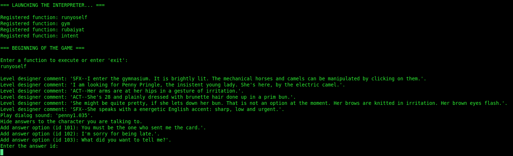

# Titanic-aoot-script-interpreter

## Description

The goal of this small application is to act as a parser and interpreter of the scripts used by the game "Titanic: an adventure out of time" released in 1996 by Cyberflix.

By scripts, we mean not the scenario of the game, but the scripts used to describe behaviors of the NPC (aka "Puppets" in the game).

## Goal

The goal of this work was to initialize a parser when I started to create my own POC of an open-source version of the game, using the original assets + new ones. Numerous options are available for this kind of project, and one of the ideas was to reuse the puppet scripts and even extends them in order to match the extended or randomized plot of the new version of the game.

In the case of my POC, it is written in Java, so the interpreter is too, so I could integrate it to the POC and the scenario engine with less difficulties.

In the end, the job is incomplete but well advanced. I hope this could help someone somehow, or to inspire him/her to do its own version.

## Current limitations

* I have never met this use case, but if a global and a local variable have the same name, and one of them is modified, it is always the global one that will get the new value. I think it could be easily fixed by throwing an error if both exist (the error coming of the parsed script).
* Parsing a condition parameter returned by a call to a function (for instance: ```if foo()``` is not yet supported. It requires some work to fix it.
* Some internal (game engine) functions are not supported yet, but it is not a big deal. 
* Another big one: the current version can only parses single condition, not multiples one. The two following examples are not managed:
```
// For Penny Pringle:
if mission = 2 & currentset () = "recept1c"

// For Zeitel
if msg = "getlost" | zeitgossip = 1
```

## How to use it

* Compile the project.
* Run it, giving the absolute path of the target script as the parameter:

```java -jar titanic-script-interpreter-1.0-SNAPSHOT.jar /home/you/Desktop/scripts/before.txt```



